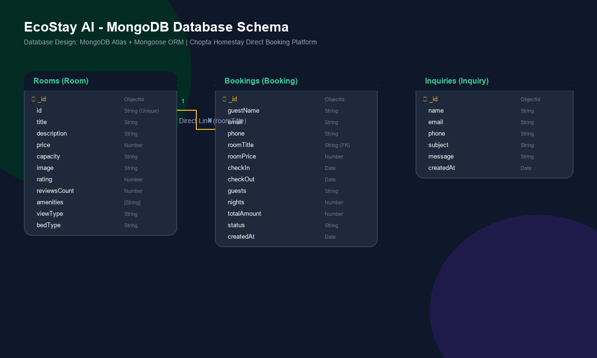

# EcoStay AI – Smart Direct Booking & Rural Tourism Management Platform

A premium frontend-only prototype of a direct booking platform for Himalayan eco-homestays in Chopta, Rudraprayag District, Uttarakhand. Built to demonstrate sustainable travel, direct-to-host bookings (0% middleman fees), and interactive local tourism guides for a Technology Business Incubator (TBI) internship evaluation.

---

## 🌟 Project Objective

The goal of **EcoStay AI** is to build a modern, high-conversion direct booking platform inspired by Airbnb and Booking.com, designed specifically for local, off-grid homestays in remote Himalayan regions. 

Corporate travel portals often charge high commission percentages (15% to 25%), which drains revenue away from local mountain villagers. EcoStay AI connects travelers directly with homestay operators via integrated WhatsApp links and automated check-in approvals, keeping 100% of booking revenue in the rural community while promoting carbon-neutral tourism.

---

## 🚀 Key Features

*   **Premium Airbnb-Inspired Design:** Responsive layouts with custom scrollbars, gradient animations, and glassmorphism.
*   **Persistent Navigation & Dark Mode:** Auto-saving dark mode toggle integrated with Tailwind CSS utility classes.
*   **Dynamic Search Routing Widget:** Interactive guest and date search selectors on the homepage that route users to custom-filtered room configurations.
*   **Sustainable Rooms Listings:** Reusable `RoomCard.jsx` showing room details, eco-certifications, amenities lists, and guest capacities.
*   **Interactive Booking Flow:** Automatic night count and eco-tax calculation modal that records booking requests to browser `localStorage` in real-time.
*   **Altitude & Elevation Profile:** Visual elevation comparisons of Tungnath, Chandrashila, and Deoria Tal treks for safety preparation.
*   **Chopta AI Travel Planner:** Live floating AI assistant widget simulating conversational answers about itineraries, packaging advice, and winter weather.
*   **Admin Control Center:** Live dashboard listing total bookings count, dynamic occupancy stats, commission-free revenue calculations, and active approval/rejection operations.
*   **Contact Inquiry Logs:** Submissions from the Contact Page are logged and displayed in the Admin Portal.

---

## 📁 Folder Structure

The project conforms to the Next.js 15 App Router structure:

```text
Trishul Ecosystem/
├── app/                      # Next.js App Router Page Routes
│   ├── admin/                # Admin Dashboard Portal (/admin)
│   │   └── page.js           # Admin controller
│   ├── attractions/          # Local Treks Guide Page (/attractions)
│   │   └── page.js           # Attractions list view
│   ├── contact/              # Local Helpdesk Coordination Page (/contact)
│   │   └── page.js           # Contact form and phone links
│   ├── rooms/                # Homestay Listing Page (/rooms)
│   │   └── page.js           # Search-linked filters & room cards
│   ├── favicon.ico           # Web browser icon
│   ├── globals.css           # Tailwind + Custom theme style design tokens
│   ├── layout.js             # Root shell loading Google Fonts & SEO meta
│   └── page.js               # Homepage sections
├── components/               # Reusable UI components
│   ├── AiPlanner.jsx         # Floating AI Travel Assistant chat widget
│   ├── BookingModal.jsx      # Reservation form with pricing calculator
│   ├── Footer.jsx            # Multi-column descriptive footer
│   ├── Hero.jsx              # Parallax mountain backdrop & search widget
│   ├── Navbar.jsx            # Mobile-responsive glass header + Dark toggle
│   └── RoomCard.jsx          # Props-driven eco-room details display
├── data/                     # Mock Database JSON models
│   ├── attractions.js        # Altitude, trekking difficulty info
│   └── rooms.js              # Room pricing, amenities, and details
├── public/                   # Public static files
├── package.json              # Dependencies and npm script configs
└── README.md                 # Main Documentation
```

---

## 🛠️ Installation & Setup Steps

Follow these steps to run the EcoStay AI application locally:

### 1. Prerequisite Checklist
Ensure you have [Node.js](https://nodejs.org/) installed (version 18+ recommended) and `npm` package manager.

### 2. Install Packages
In your terminal, navigate to the project directory and install the dependencies:
```bash
npm install
```

### 3. Launch Development Server
Start the Next.js local server:
```bash
npm run dev
```
The server will boot up. Open your browser and navigate to:
*   Homepage: **[http://localhost:3000](http://localhost:3000)**
*   Admin Portal: **[http://localhost:3000/admin](http://localhost:3000/admin)**

### 4. Create Production Build (Optional)
To package the app for evaluation:
```bash
npm run build
npm run start
```

---

## 🗄️ Database Integration & Design

EcoStay AI is integrated with **MongoDB** via **Mongoose ODM** for real-time, persistent storage of rooms, reservations, and traveler contact inquiries.

### Why MongoDB + Mongoose?
1. **Document-Based Schema Flexibility:** Himalayan homestay amenities, descriptions, and road conditions are highly variable and dynamic. MongoDB's BSON structure accommodates nested array objects (like `amenities` and custom trekking guides) without relational join tables.
2. **Seamless Next.js Integration:** Using Mongoose allows us to define schema models in pure JavaScript, handling serverless connection pooling easily with cached instances.
3. **No Compilation/Migration Churn:** Unlike SQL schemas, MongoDB lets us update data structures quickly without forcing database migrations during early incubator prototype iterations.

---

## 📊 Database Schema Diagram

Below is the visual mapping of entities, fields, data types, and relationships (Rooms, Bookings, Inquiries):



*   **Rooms (One-to-Many) Bookings:** Linked directly via `roomTitle` (FK link). Every booking request references the specific homestay selected.
*   **Inquiries:** Independent log collection containing user form data for trek guides and safety coordination.

---

## ⚙️ How to Set Up the Database

Follow these steps to connect and configure the MongoDB database:

### 1. Configure the Environment Variables
Copy `.env.example` to a new file named `.env` in the root directory:
```bash
cp .env.example .env
```

### 2. Choose Your Connection Mode

#### Option A: Local MongoDB (Recommended for Offline Testing)
1. Ensure you have MongoDB installed and running on your system (runs on port `27017` by default).
2. Configure the connection string in `.env`:
   ```env
   MONGO_URI=mongodb://127.0.0.1:27017/ecostay
   ```

#### Option B: MongoDB Atlas (Cloud Hosted)
1. Sign up for a free account at [mongodb.com/cloud/atlas](https://www.mongodb.com/cloud/atlas).
2. Create a free cluster on the **M0 Shared Tier**.
3. Under **Network Access**, whitelist your IP address (or select `0.0.0.0/0` to allow connection from anywhere).
4. Under **Database Access**, create a user with a secure password.
5. Click **Connect** → **Drivers** and copy the Connection String. Paste it into `.env`, replacing `<username>` and `<password>`:
   ```env
   MONGO_URI=mongodb+srv://<username>:<password>@cluster0.xxxxxx.mongodb.net/ecostay?retryWrites=true&w=majority
   ```

### 3. Initialize and Seed the Database
1. Launch the local development server:
   ```bash
   npm run dev
   ```
2. Navigate to the Admin Dashboard: **[http://localhost:3000/admin](http://localhost:3000/admin)**
3. Click the **Reset Simulation State** button. This will trigger a `POST` request to `/api/admin/reset`, which cleans the database and seeds it with default rooms, booking requests, and inquiries in MongoDB.
4. Go to **[http://localhost:3000/rooms](http://localhost:3000/rooms)** to browse and book homestays.

---

## 🔮 Future Development Scope

If scaled into a production startup platform, the next phases will involve:
1.  **WhatsApp Cloud API Integration:** Automated check-in OTP and room key confirmations dispatched directly to the guest and the local host's mobile number.
2.  **Local Coordinator POS:** A lightweight, offline-first mobile app for homestay owners who have unstable internet connections in Chopta.
3.  **Weather Sentinel Integrations:** Pulling real-time mountain wind, temperature, and avalanche data from the Indian Meteorological Department (IMD) to warn trekkers.

